```mermaid
sequenceDiagram
    participant U as 👤 User
    participant B as 🖥️ Backend
    participant G as 🤖 Gemini (Embeddings + LLM)
    participant F as 📊 FAISS DB
    participant T as 🎙️ Azure TTS

    %% Step 1: Upload PDFs
    U->>B: Upload PDFs
    B->>B: Extract text + headings + page numbers
    B->>G: Generate embeddings for all passages
    G-->>B: Return embeddings
    B->>F: Store embeddings in FAISS

    %% Step 2: Select text
    U->>B: Select text + related PDFs in PDF viewer
    B->>G: Generate embedding for selected text
    G-->>B: Return embedding

    %% Step 3: Find related content
    B->>F: Compare selected embedding with stored embeddings
    F-->>B: Return Top-k related passages
    B-->>U: Show passages with headings + page numbers

    %% Step 4: Generate Insights
    U->>B: Click "Generate Insight"
    B->>G: Send selected text + context
    G-->>B: Return insights (facts, contradictions, nuggets)
    B-->>U: Display insights

    %% Step 5: Generate Podcast
    U->>B: Click "Generate Podcast"
    B->>G: Summarize text + context
    G-->>B: Return summary
    B->>T: Convert summary to MP3
    T-->>B: Return audio file
    B-->>U: Play/Download Podcast
```

Adobe Hackathon 2025 – Logic & Workflow
=====================================================================

This document explains the detailed logic, architecture, and workflow
of the Document Intelligence Engine we developed across Round 1A, 1B,
and the final AI-powered prototype of Adobe Intelligence PDF Engine.

------------------------------------------------
1. Task 1A – PDF Structure Extraction
------------------------------------------------
Objective:
- Parse PDFs and extract structural metadata for better navigation and context.

Logic:
1. PDF files uploaded by the user are parsed using PyMuPDF.
2. For each page:
   - Extract text content
   - Extract section headings, sub-headings, and hierarchy levels
   - (Internal Logic) - Giving score to every content
   - Store page number + heading + text as structured JSON
3. The output is a searchable dataset that preserves context:
   Example:
   {
     "pdf": "sample1.pdf",
     "page": 4,
     "heading": "Introduction to AI",
     "level": "H2",
     "text": "Artificial intelligence is the simulation of..."
   }

Outcome:
- Enabled users to see where the content exists (with headings and page numbers).
- Laid foundation for contextual search in 1B.

------------------------------------------------
2. Task 1B – Persona-Based Search (Original)
------------------------------------------------
Objective:
Retrieve and rank document content based on a chosen persona and their job-to-be-done (JTBD).

Logic:
1. Users select a persona and specifies their job-to-be-done(JTBD).
2. System filters relevant content based on:
   - Semantic similarity
   - Persona preferences (e.g., a researcher gets deeper theory, a student gets simpler explanation).
3. Results displayed as filtered content.
4. Final Score = (Relevance × Persona Weight × JTBD Weight).

Outcome:
- Allowed users to get persona-tailored results(offline) instead of just keyword matches.
- But it was rigid (persona rules were hardcoded, not dynamic) and slower than embeddings.

------------------------------------------------
3. Task 1B – Related Content Search (Revised with Gemini)
------------------------------------------------
Objective:
- Replace persona filtering with semantic selection search.

Logic:
````
⚙️ Core Logic of Document Intelligence Engine
Our prototype combines document parsing, semantic search, and AI-powered insights into one system. Below is the detailed working of the core engine:

---

### 1. PDF Upload & Text Extraction
- Users upload one or more PDFs.  
- Each PDF is parsed using **PyMuPDF**, extracting:
  - Page number  
  - Heading/Sub-heading (H1, H2, etc.)  
  - Text content  

The extracted passages are structured and stored in memory for further processing.

---

### 2. Vector Embedding Generation
- Each extracted passage is converted into a dense vector embedding using **Google Gemini Embedding API (`models/embedding-001`)**.  
- These embeddings capture semantic meaning of text, enabling similarity search.

**Example:**
```python
embedding = genai.embed_content(
    model="models/embedding-001",
    content=passage["text"]
)["embedding"]
````

---

### 3. Vector Database (FAISS) Indexing

* All passage embeddings are stored in a **FAISS index** (Facebook AI Similarity Search).
* FAISS allows fast similarity search using cosine similarity or L2 distance.
* This enables sub-second retrieval even when thousands of passages are stored.

---

### 4. User Interaction: Text Selection

* Users can open PDFs in the web interface and select a piece of text.
* The selected text is sent to the backend.
* The backend generates an embedding vector for this selection using Gemini.

---

### 5. Semantic Similarity Search

* The selected text embedding is compared against all stored passage embeddings using **FAISS**.
* The system retrieves **Top-k related passages** ranked by similarity score.

**Example output:**

```
{
  "pdf": "AI_Research.pdf",
  "page": 10,
  "heading": "Applications of AI",
  "text_preview": "AI is used in healthcare, finance...",
  "score": 0.87
}
```

---

### 6. Contextual Insights (Gemini)

* After retrieving related passages, users can click **“Generate Insight”**.
* Gemini LLM analyzes the selected text + retrieved passages and produces a short contextual insight such as:

  * Interesting fact
  * Contradiction
  * Exception
  * “Did you know?” style knowledge nugget

---

### 7. Podcast Generation (Azure TTS)

* Users can also click **“Generate Podcast”**.
* The selected text + related passages are summarized by Gemini.
* The summary is then converted into speech using **Google Cloud / Azure Text-to-Speech API**, generating a playable MP3 podcast.

---

## ✅ Final Flow

```
Upload PDFs → Extract text → Convert to vectors → Store in FAISS  
Select text → Convert to vector → Similarity search in FAISS → Retrieve related passages  
Generate insights (Gemini) or podcast (TTS) from retrieved context
```

---

### This structured logic ensures:

* ⚡ **Speed** (FAISS indexing for fast retrieval)
* 🎯 **Accuracy** (semantic embeddings instead of keyword search)
* 🎧 **Engagement** (insights + podcast features)


Outcome:
- A flexible search system that surfaces related context without persona overhead.

------------------------------------------------
4. Final Combined Workflow 
------------------------------------------------
Objective:
- Build a user-centric experience to explore documents, discover insights,
  and extend to multimodal interaction (text + audio).

Logic:
1. Upload PDFs
   - Backend extracts text + headings + page numbers (Task 1A logic).
   - Generates embeddings for all passages using Gemini embeddings.

2. Select Text and all related PDFs
   - User selects all related PDFs and selects text directly in the PDF viewer.
   - Selection sent to backend.

4. Find Related Content
   - Gemini embedding generated for selected text.
   - Compared with pre-stored embeddings.
   - Top-k passages returned with heading + page number.

5. Generate Insights
   - On button click, selected text + related context sent to Gemini LLM.
   - Gemini generates:
     - Short insights
     - Exceptions / contradictions
     - "Did you know" style highlights.

6. Generate Podcast
   - Same text + context sent to Azure Text-to-Speech.
   - Returns MP3 narration.
   - User can play/download audio directly.

```mermaid
flowchart TD

    A[Upload PDFs] --> B[Extract text, headings, page numbers - Task 1A logic]
    B --> C[Generate embeddings for all passages using Gemini]
    
    C --> D[Select Text + Related PDFs in PDF viewer]
    D --> E[Send selection to Backend]
    
    E --> F[Find Related Content - Gemini embedding for selected text]
    F --> G[Compare with stored embeddings in FAISS]
    G --> H[Return Top-k related passages with heading + page number]

    H --> I[Generate Insights - Button Click]
    I --> J[Gemini LLM produces insights: short facts, exceptions, contradictions, highlights]

    H --> K[Generate Podcast]
    K --> L[Azure Text-to-Speech converts context to MP3]
    L --> M[Play or Download Audio]

    %% Styling
    classDef step fill:#f4f4f4,stroke:#333,stroke-width=1px,rx=10,ry=10;
    class A,B,C,D,E,F,G,H,I,J,K,L,M step;
```

------------------------------------------------
5. Key Innovations
------------------------------------------------
- Combined structural parsing (1A) with semantic search (1B).
- Shifted from persona filtering to contextual related content.
- Introduced insight layer powered by Gemini.
- Added podcast generation for multimodal experience.
- Fully containerized with Docker for lightweight and fast deployment.
