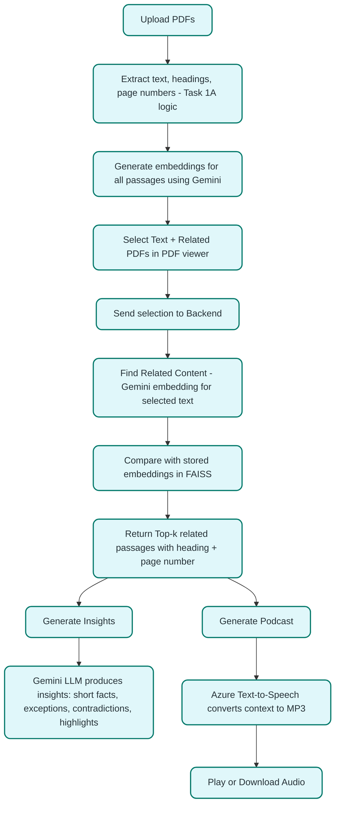

# Adobe Hackathon 2025 – Grand Finale
**PDF Intelligence App**

**Team Name:** UV Boys  
**Challenge:** Grand Finale  
**Submission Date:** August 19, 2025

## PDF Intelligence App
 FOR Preview - https://adobe-pdf-project.onrender.com/
An end-to-end PDF intelligence web app that lets you upload PDFs, view and select text, run multi-document semantic search powered by Gemini embeddings, extract outlines/sections, generate insights, and even create a short podcast using Text-to-Speech. The project ships with a production-ready Docker image that builds the React (Vite) frontend and serves it via a Flask backend.

```
Adobe-PDF-Project/
├── backend/
│   ├── .env
│   ├── app.py
│   ├── docker-entrypoint.sh
│   ├── requirements.txt
│   └── services/
│       ├── azure_tts.py
│       ├── gemini_search.py
│       ├── pdf_processor_1a.py
│       ├── pdf_processor_1b.py
│       └── storage.py
├── public/
│   ├── pdfjs/
│   ├── test-adobe.html
│   └── vite.svg
├── src/
│   ├── App.css
│   ├── App.jsx
│   ├── ClickSpark.jsx
│   ├── index.css
│   ├── main.jsx
│   ├── assets/
│   │   └── react.svg
│   ├── services/
│   │   └── api.js
│   └── components/
│       ├── Library.jsx
│       ├── PDFViewer.jsx
│       ├── ProcessingPanel.jsx
│       ├── Sidebar.jsx
│       └── UploadModal.jsx
├── .dockerignore
├── .gitignore
├── Dockerfile
├── README.md
├── README_SEARCH_FEATURE.md
├── eslint.config.js
├── index.html
├── package-lock.json
├── package.json
├── postcss.config.js
├── storage/            (excluded contents)
├── tailwind.config.js
└── vite.config.js
```

## Contents
- Overview
- Features
- For Logic And Workflow
- Tech Stack
- How to set it up?
- Overall Workflow
- Future Enhancements

  ## 📑 Table of Contents
- [Overview](#overview)
- [Features](#features)
- [For Logic And Workflow](#for-logic-and-workflow)
- [Tech Stack](#tech-stack)
- [How to set it up?](#how-to-set-it-up)
- [Overall Workflow](#overall-workflow)
- [Future Enhancements](#future-enhancements)


## Overview
- **Frontend**: React 18 + Vite, TailwindCSS, Axios
- **Backend**: Flask + Flask-CORS
- **AI**: Google Gemini (text + embeddings) for insights and search
- **TTS**: Azure Cognitive Services (Text-to-Speech)
- **PDF**: PyMuPDF (text extraction), pdf.js viewer


## Features
- **Upload PDFs**: Drag-and-drop multiple files. Files are stored under `backend/storage` with metadata.
- **Library View**: Browse uploaded files with metadata and quick actions.
- **PDF Viewing**: Uses `public/pdfjs` to render PDFs; also includes Adobe DC Embed SDK on the page for optional use cases.
- **Text Selection**: Selecting text inside the viewer dispatches a message so the app can search or generate insights on the selection.
- **Outline Extraction(1A)**: Extracts headings/outline from a PDF.
- **Persona-based Extraction(1B)**: Extracts sections tailored to a persona and objective across multiple PDFs.
- **AI Semantic Search**: Semantic search across selected PDFs with FAISS and Gemini embeddings. Returns matched pages with snippets.
- **Insights**: Summarize key takeaways, contradictions, and connections.
- **Podcast**: Generates a short script via Gemini and converts to audio via Azure TTS.
- **Config at Runtime**: Docker entrypoint injects runtime config (`env.js`) so you can change providers/keys without rebuilding the image.
- **Fast Retrieval** – Vector embeddings stored in FAISS index enable sub-second semantic search.
- **Web Interface** – Built with React for smooth interaction and intuitive user experience.
- **Offline Support** – Works completely offline for PDF parsing, heading extraction, and related content retrieval. (Only Insights & Podcast features require internet as they depend on Gemini & Azure APIs)

## **For Logic And Workflow**
- [Detailed Logic & Workflow](Logic_workflow.md)

## Tech Stack

- Frontend: React + Vite
- Backend: FastAPI (Python)
- PDF Parsing: PyMuPDF
- Vector Search: FAISS
- Embeddings & LLM: Google Gemini API (gemini-2.5-flash)
- Podcast Generation: Azure Text-to-Speech
- Containerization: Docker

# **How to set it up?**

## Docker
Build the image:
```bash
docker build -t yourimageidentifier .
```

Run the container (example):
```bash
docker run --rm -p 8080:8080 \
  -e ADOBE_EMBED_API_KEY=YOUR_KEY \
  -e LLM_PROVIDER=ollama \
  -e OLLAMA_MODEL=llama3 \
  -e TTS_PROVIDER=local \
  -e GEMINI_API_KEY=your_gemini_api_key \
  yourimageidentifier
```


## Local Development
Prerequisites:
- Node 18+ and npm
- Python 3.11+

Install dependencies:
```bash
npm install
pip install -r backend/requirements.txt
```

Run backend:
```bash
python backend/app.py
```
The Flask server listens on `0.0.0.0:8080` (as configured in `app.py`).

Run frontend (Vite dev server):
```bash
npm run dev
```
Access the app at the URL shown by Vite (typically `http://localhost:3000`). The frontend calls the backend via `/api` (CORS is enabled in Flask). For production builds, use Docker.


## Storage and Persistence
- Files, metadata, and generated audio are stored under `backend/storage/`.
- When running via Docker, mount a volume to `/app/storage` to persist across restarts.


## Security Notes
- Do not hardcode production API keys. Pass them via environment variables.
- By default, `backend/app.py` contains demo/placeholder keys; replace them for production use.
- Validate and sanitize any uploaded files if exposing this app publicly.


## Overall Workflow


## Future Enhancements

- Support for larger PDF datasets with persistent FAISS index (disk storage).
- Advanced UI with highlighted search matches inside PDF.
- Multi-language insights & podcast support.
- Collaboration features (multiple users exploring the same document in real time).
- Role-based access control for enterprise use cases.

---

> *This solution demonstrates a next-generation Document Intelligence Engine, combining robust PDF heading extraction, offline semantic search, AI-powered contextual insights, and podcast generation — all wrapped in a scalable, production-ready web application for the Adobe Hackathon 2025.
> ~ TEAM UV Boys*  
